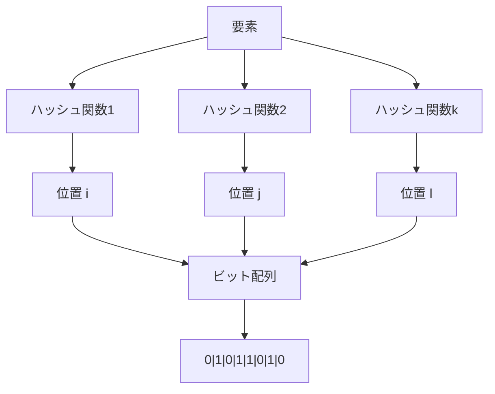
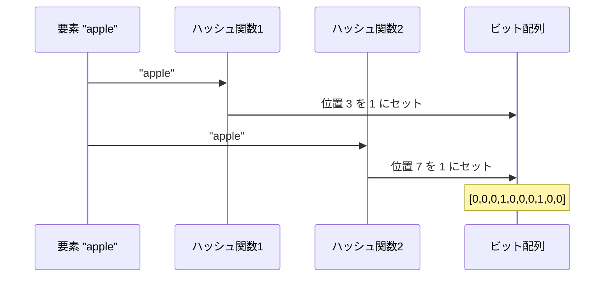
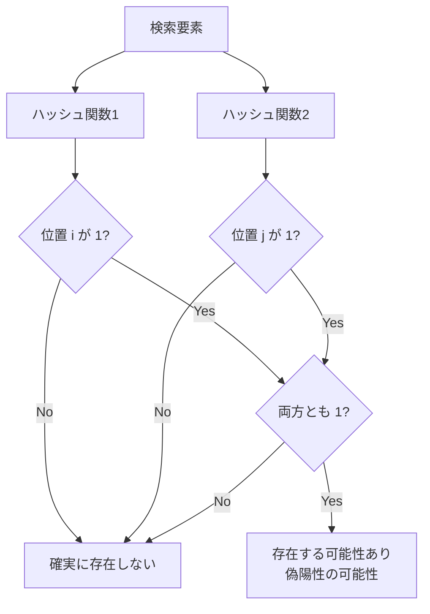
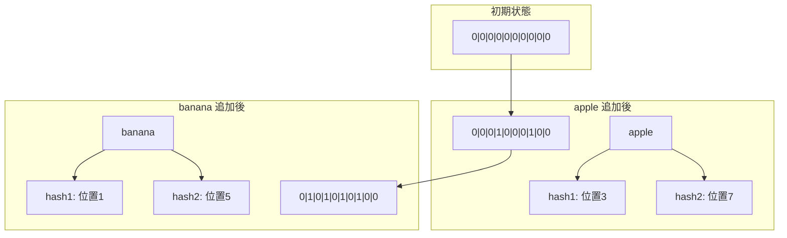
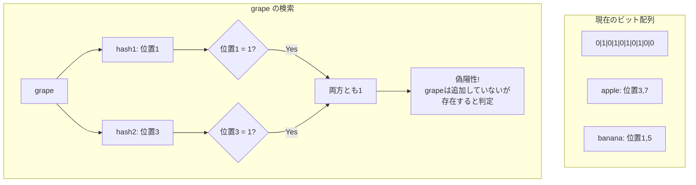
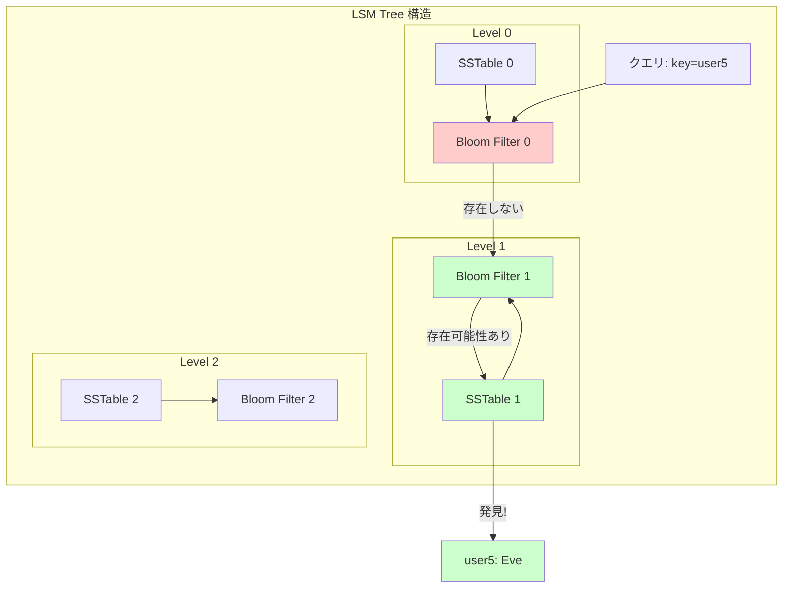
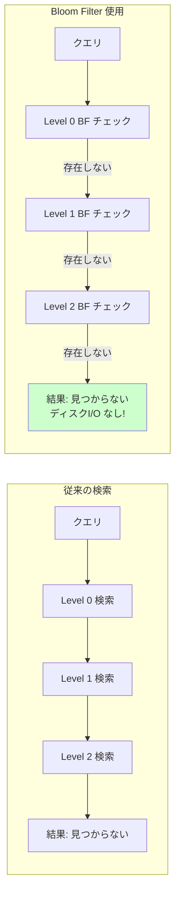
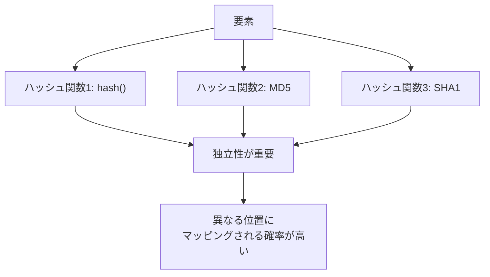
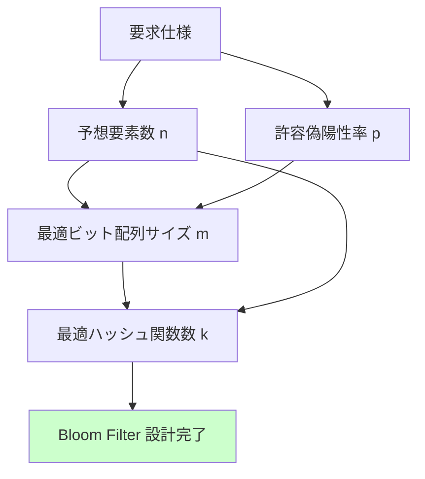

# Bloom Filter 解説

## 概要

Bloom Filter は確率的データ構造の一種で、要素がセットに含まれているかを効率的にチェックできます。

**特徴:**
- ✅ **偽陰性なし**: 含まれている要素は必ず検出される
- ⚠️ **偽陽性あり**: 含まれていない要素でも「含まれている」と判定される可能性
- 🚀 **高速**: O(k) の時間計算量（kはハッシュ関数の数）
- 💾 **省メモリ**: 要素自体を保存せず、ビット配列のみ使用

## 基本構造



## 動作原理

### 1. 要素の追加



### 2. 要素の検索



## 具体例: "apple", "banana" の追加



## 偽陽性の発生例



## LSM Tree での活用



## パフォーマンス比較



## 実装のポイント

### ハッシュ関数の選択



### パラメータ設計



## 数式

### 最適パラメータ

- **ビット配列サイズ**: `m = -(n × ln(p)) / (ln(2)²)`
- **ハッシュ関数数**: `k = (m/n) × ln(2)`
- **実際の偽陽性率**: `p' = (1 - e^(-kn/m))^k`

## 使用例

このディレクトリには以下の実装例が含まれています：

1. **`simple_bloom_filter.py`** - 基本的な動作理解用
2. **`bloom_filter.py`** - 完全な実装と検証
3. **`lsm_bloom_filter.py`** - LSM Tree での使用例

```bash
# 実行例
python simple_bloom_filter.py
python bloom_filter.py
python lsm_bloom_filter.py
```

## まとめ

Bloom Filter は以下の場面で威力を発揮します：

- 🗄️ **データベース**: LSM Tree、BigTable、Cassandra
- 🌐 **分散システム**: 重複検出、キャッシュ最適化
- 🔍 **検索エンジン**: クロール済みURL管理
- 📊 **ビッグデータ**: Apache Spark、Hadoop
